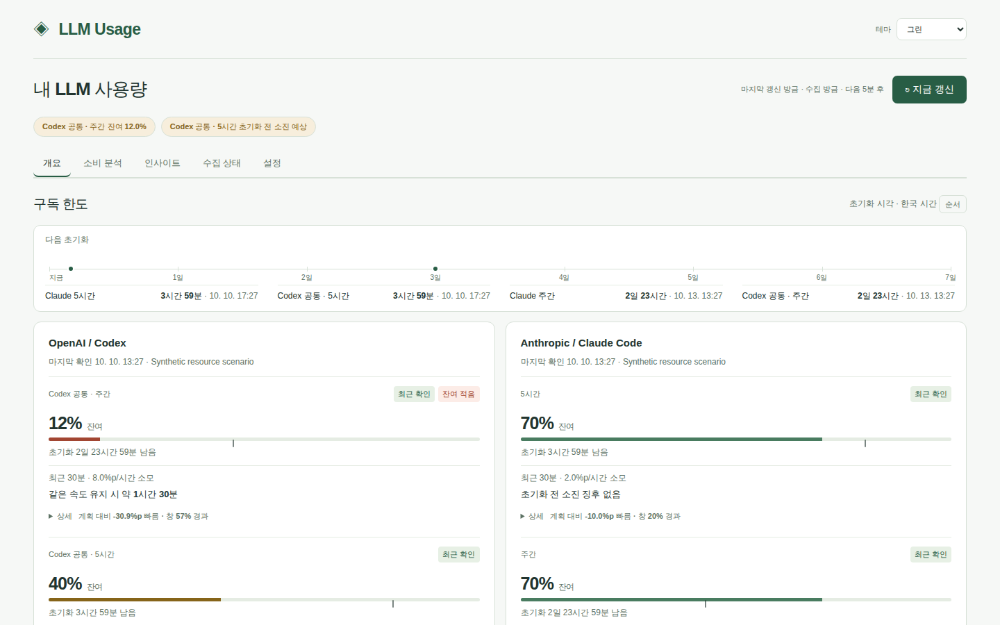

# LLM Usage Dashboard

개인 LLM 도구의 **구독 한도·작업 전망·크레딧과 토큰 사용량**을 확인하는 자체 호스팅 대시보드입니다.
Linux/WSL에서 실행하며 Tailscale 소유자 계정으로만 접근합니다. 웹과 수집기는 독립 프로세스이고 Resource Guard는 필요하지 않습니다.

A self-hosted dashboard for LLM quotas and usage. Linux/WSL, private Tailscale access, local-first collection. Korean UI and documentation. Independent project; not an official provider product.

현재 릴리스: **[v0.3.0](https://github.com/jihoon22-lee/llm-usage-dashboard/releases/tag/v0.3.0)** · [변경 기록](CHANGELOG.md)

## 기능

- 한도·계획·사용량·리포트·상태 다섯 탭: 한도 탭에서 잔여·다음 초기화 일정·추가 자원을 펼치지 않고 확인하고, 계획 탭에서 작업 전망을 확인
- 24시간 안에 만료되는 크레딧·초기화권 알림, 모바일 아래 시트로 여는 수동 자원 기록
- 한도·초기화·수집 상태, 모든 모델의 사용 추이·비용 추정·프로젝트/세션 분석
- 서비스·모델별 작업 지속 시간과 먼저 제약하는 한도, 최근 30분·비교 3시간 소모 속도
- Codex·Claude 크레딧·초기화권 읽기 전용 조회, 자동 조회를 보완하는 수동 자원 기록
- 각 초기화권·크레딧의 만료일을 연도·KST 시각으로 상시 표시, 미제공·부분 만료 구분
- 오늘·이번 주 작업시간별 전망, 적용 범위·지출 조건·만료·확인 시각 구분
- 캐시·추론 구분, 스트리밍·재수집·Windows/WSL 사본 중복 제거
- 데스크톱·모바일, CSV, 제한된 오프라인 통계 사본, 선택적 외부 알림
- 없는 원본 값을 0이나 100%로 채우지 않고 미제공·실패·오래된 관측을 구분

## 지원 범위

| 도구 | 토큰 원본 | 한도 경로 | 제한 |
|---|---|---|---|
| Codex | 로컬 JSONL | 기존 CLI App Server, 크레딧·초기화권 | 불완전·모호한 누적 이력은 완전 복구 불가 |
| Claude Code | 로컬 JSONL | 기존 OAuth·상태줄, 선불 잔액·지출 조건·초기화권 | OAuth는 외부 연동용 공개 API가 아님 |
| Antigravity | CLI/앱 SQLite | 상태줄·실행 중인 WSL 앱 | 내부 스키마/RPC 변경에 영향받음 |
| OpenCode Go | 로컬 SQLite | 계정 usage 경로 | 구독 계정의 실제 한도 수신 미검증 |
| Devin CLI | 로컬 SQLite | 기존 CLI 계정 경로 | 내부 API, Cloud 세션 미지원 |

[구조와 수집 경로](docs/architecture.md)에서 과거 실수신과 합성 검증을 구분합니다.
Windows는 선택한 프로필의 **기록 수집 대상**입니다. Windows/macOS 네이티브 서버 설치는 지원하지 않습니다.

작업 전망은 관측한 속도가 유지된다는 조건의 추정입니다. 처음 계정을 확인하거나 계정·구독 조건이 바뀌면 새 관측이 필요합니다. 최근 속도는 최소 15분, 비교 속도는 최소 90분의 연속 이력을 사용하며 초기화 후 용량을 미리 더하지 않습니다. 모델 매핑·필수 한도·속도가 불확실하면 판단을 보류합니다.

추가 자원의 잔액·지출 한도·초기화권 횟수는 합산하지 않습니다. Claude 클라우드 세션 전용 크레딧은 별도 잔액·만료로 표시하며 로컬 구독 한도에 합산하지 않습니다. API 전용 크레딧은 수동 기록을 지원하며 구독형 작업의 추가 자원으로 추천하지 않습니다. 조회·기록만 제공하고 초기화권 사용·크레딧 구매·자동 충전 설정 변경은 실행하지 않습니다. [화면과 자원 조건](docs/usage.md)을 확인하세요.



이미지는 개인 데이터가 없는 합성 예시입니다.

## 빠른 시작

Python 3.11+, uv 0.12.23, Git, systemd가 실행되는 Linux/WSL, 로그인된 Tailscale과 HTTPS Serve 환경이 필요합니다.
서버 경로·홈에는 ASCII 영문자·숫자·`_ . / -`만 사용할 수 있습니다. 먼저 [설치 안내](docs/setup.md)를 확인하세요.

```bash
git clone --branch v0.3.0 https://github.com/jihoon22-lee/llm-usage-dashboard.git
cd llm-usage-dashboard
git switch -c main
uv sync --locked --no-dev
.venv/bin/llm-usage init
.venv/bin/llm-usage collect --once
sudo ./install.sh --owner "$USER"
```

v0.3.0의 고정된 설치 절차입니다. 태그 clone의 detached HEAD에서 설치·업데이트용 로컬 main을 생성합니다. 개발 최신 코드는 원격 main을 사용하세요. 기존 v0.1.0에는 uv.lock이 없으며, 업데이트는 [의존성 전환 안내](docs/operations.md)를 따릅니다.

수집은 로컬 기록을 읽고 기존 인증으로 계정 한도를 조회합니다. Windows와 상태줄 연결은 [명시적으로 선택](docs/setup.md)합니다.
설치기가 출력하는 개인 Tailscale 주소로 접속합니다. Funnel로 인터넷에 공개하지 않습니다.
Git checkout이 서비스 설치·업데이트의 공식 경로입니다. Release의 wheel·소스 배포본은 CLI/웹 런타임이며 단독 서비스 설치기가 아닙니다. 릴리스의 `SHA256SUMS`와 `release-manifest.json`으로 산출물 무결성과 검증한 커밋을 확인할 수 있습니다.

## 문서

- [설치와 설정](docs/setup.md), [화면과 CLI](docs/usage.md)
- [구조·API·데이터 의미](docs/architecture.md), [운영·백업·복구](docs/operations.md)
- [개발·검증·기여](CONTRIBUTING.md), [보안·개인정보](SECURITY.md), [변경 기록](CHANGELOG.md)

비용은 API 단가로 환산한 추정이며 구독 청구액이나 실제 크레딧 차감액이 아닙니다. 비용 추이 CSV의 빈 비용은 미산정이며, 부분 산정 범위는 함께 내보내는 미산정 토큰 열로 확인합니다. 내부 제공사 API는 변경될 수 있습니다. 초기화권별 상세·만료·크레딧 단위가 미제공이면 임의로 채우지 않습니다.
본문을 저장하지 않아도 세션 ID·프로젝트명·사용 시각은 개인 정보가 될 수 있습니다. 실제 DB·화면·원본 로그를 공개 이슈에 올리지 마세요.
기존 DB의 경로형 프로젝트명은 자동 변환하지 않아 신규 이름과 분리되거나 예산 재설정이 필요할 수 있습니다.

[MIT 라이선스](LICENSE)입니다.
