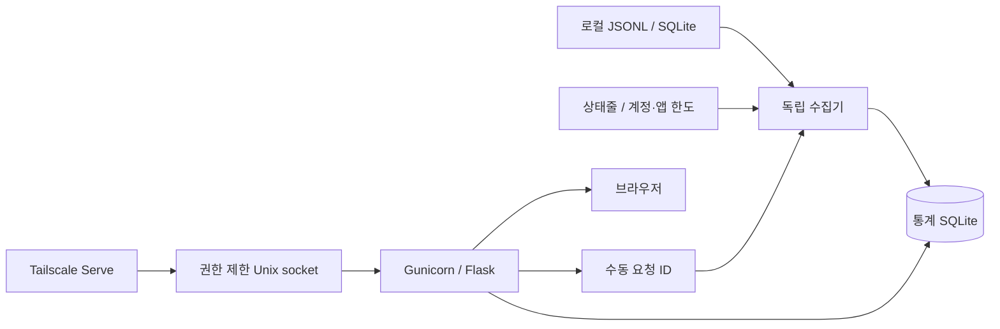

# 구조·수집 경로·API

## 역할과 집계

로컬 기록·계정 한도는 기본 5분, 상태줄 수신함은 2초 루프에서 확인합니다. 최초 원본 수집은 더 오래 걸릴 수 있습니다.
웹은 수집 요청 ID를 기록하고 수집기는 완료 ID와 소스별 결과를 갱신합니다. Resource Guard는 선택적 통합입니다.
collect/antigravity/devin/limits/statusline은 원본·한도, store는 이벤트·상태·한도·롤업, pricing은 단가 이력, webapp은 인증·조회·설정 API를 담당합니다.
프런트엔드는 빌드 없는 JavaScript이며 theme, core·format·charts, 기능 모듈의 로딩 순서에 의존합니다.
provider(모델 제작사)·route(구독 경로)·model을 구분하고 요청/세션 식별자로 스트리밍·재수집·사본·부모 상속 중복을 제거합니다.
Codex 누적 카운터의 초기화·부분 시작·동일 시각 모호성은 별도 표시합니다. Antigravity의 상충 요청 수치는 한 관측을 유지하고 경고합니다.
events와 usage_hourly는 같은 트랜잭션의 트리거로 유지합니다. 정확한 시각 경계·세션은 이벤트를 사용합니다. [합계 규칙](usage.md)을 따릅니다.

## 수집과 검증 수준

아래 실제 수신은 공개 전 개발 과정의 확인 기록입니다. 공개 CI는 합성 원본을 사용하며 계정을 조회하지 않습니다.

| 경로 | 원본·한도 | 과거 확인 및 제약 |
|---|---|---|
| Codex | sessions/archived_sessions JSONL, account/rateLimits/read | 토큰·계정 한도 실수신 확인; 저장된 누적 관측 대조는 원본 전체 대조와 다름 |
| Claude | projects JSONL, 기존 OAuth /api/oauth/usage·상태줄 | 실수신 확인; OAuth는 공개 외부 연동 API 보장 없음, headless 상태줄 제약 |
| OpenCode Go | opencode.db, Go usage 경로 | 토큰 수집; 당시 계정 구독 오류로 한도 실수신 미확인 |
| Antigravity | CLI/앱 conversations DB, 상태줄·WSL RPC | CLI 1.1.28/language server 2.19.1 원본 확인; 앱 실행과 내부 스키마 의존 |
| Devin CLI | sessions.db, 기존 CLI 계정 상태 경로 | 로컬 요청·일/주간 한도 실수신; Cloud 미지원, 당시 Windows DB 빈 스키마 |

Antigravity는 RetrieveUserQuotaSummary를 우선하고 GetUserStatus로 대체할 수 있습니다. 응답에 없는 창은 만들지 않습니다. 일부 생략된 proto3 float 0은 확인된 스키마 의미대로 처리합니다.
Claude는 정상 조회 최소 5분, 429는 10/20/40/60분과 더 긴 Retry-After, 네트워크 실패는 1/2/4/8/10분 대기를 적용합니다. 인증 오류는 원래 인증 파일 변경을 기다립니다.
인증 발급·갱신은 기존 도구가 담당합니다. 상세 인증 경로를 공개 예제에 넣지 마세요.

## API·신뢰 경계

| API | 역할 |
|---|---|
| GET /healthz | loopback TCP 상태 검사 |
| GET /api/usage | 기간·간격·분류·scope 통계 |
| GET /api/limits, /api/collection | 한도·수집 상태 |
| GET /api/session, /api/project | 세션·프로젝트 상세 |
| GET /api/reports, /api/notify/log | 리포트·비밀 제외 알림 결과 |
| GET /api/bootstrap, /api/config | CSRF 초기화·마스킹 설정 |
| POST /api/refresh | 202 수집 요청, collection의 완료 ID 확인 |
| POST /api/config/*, /api/notify/test | 허용 설정 저장·알림 시험 |

건강 검사 이외 요청은 Gunicorn의 실제 AF_UNIX 연결과 Tailscale 로그인 allowlist를 확인합니다. TCP 헤더 위조는 허용하지 않습니다.
쓰기는 정확한 Origin·JSON·세션 CSRF를 요구합니다. 쿠키는 독립 이름/키와 Secure·HttpOnly·SameSite=Strict를 사용합니다.
Serve는 0700 폴더의 socket으로 연결하며 Funnel을 거부합니다. 공용 reverse proxy로 임의 대체하지 마세요.
정적 자산은 내용 해시로 버전 관리합니다. 서버 no-store와 브라우저 명시적 통계 사본 저장은 별개입니다. [개인정보 범위](../SECURITY.md)를 확인하세요.
