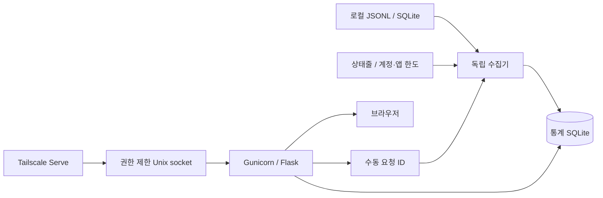

# 구조·수집 경로·API

## 역할과 집계

로컬 기록·계정 한도는 기본 5분, 상태줄 수신함은 2초 루프에서 확인합니다. 최초 원본 수집은 더 오래 걸릴 수 있습니다.
웹은 수집 요청 ID를 기록하고 수집기는 완료 ID와 소스별 결과를 갱신합니다. Resource Guard는 선택적 통합입니다.
collect/antigravity/devin/limits/statusline은 원본·한도, store는 이벤트·상태·한도·롤업, pricing은 단가 이력, webapp은 인증·조회·설정 API를 담당합니다.
resources는 자원·계정 관측과 수동 기록, planning은 모델별 제약과 조건부 작업 전망을 담당합니다. 브라우저 planning/resources 모듈은 quota/app보다 먼저 로드합니다.
프런트엔드는 빌드 없는 JavaScript이며 theme, core·format·charts, 기능 모듈의 로딩 순서에 의존합니다.
provider(모델 제작사)·route(구독 경로)·model을 구분하고 요청/세션 식별자로 스트리밍·재수집·사본·부모 상속 중복을 제거합니다.
Codex 누적 카운터의 초기화·부분 시작·동일 시각 모호성은 별도 표시합니다. Antigravity의 상충 요청 수치는 한 관측을 유지하고 경고합니다.
events와 usage_hourly는 같은 트랜잭션의 트리거로 유지합니다. 정확한 시각 경계·세션은 이벤트를 사용합니다. [합계 규칙](usage.md)을 따릅니다.

## 수집과 검증 수준

아래 실제 수신은 공개 전 개발 과정의 확인 기록입니다. 공개 CI는 합성 원본을 사용하며 계정을 조회하지 않습니다.

| 경로 | 원본·한도 | 과거 확인 및 제약 |
|---|---|---|
| Codex | sessions/archived_sessions JSONL, account/rateLimits/read | 토큰·계정 한도·크레딧·초기화권 실수신 확인; 저장된 누적 관측 대조는 원본 전체 대조와 다름 |
| Claude | projects JSONL, 기존 OAuth usage·선불 잔액·초기화권·상태줄 | 읽기 실수신 확인; OAuth는 공개 외부 연동 API 보장 없음, headless 상태줄 제약 |
| OpenCode Go | opencode.db, Go usage 경로 | 토큰 수집; 당시 계정 구독 오류로 한도 실수신 미확인 |
| Antigravity | CLI/앱 conversations DB, 상태줄·WSL RPC | CLI 1.1.28/language server 2.19.1 원본 확인; 앱 실행과 내부 스키마 의존 |
| Devin CLI | sessions.db, 기존 CLI 계정 상태 경로 | 로컬 요청·일/주간 한도 실수신; Cloud 미지원, 당시 Windows DB 빈 스키마 |

Antigravity의 loopback RPC는 자체 서명 인증서를 사용하는 로컬 서버에만 연결하며 최소 TLS 1.2를 요구합니다.
Antigravity는 RetrieveUserQuotaSummary를 우선하고 GetUserStatus로 대체할 수 있습니다. 응답에 없는 창은 만들지 않습니다. 일부 생략된 proto3 float 0은 확인된 스키마 의미대로 처리합니다.
Claude는 정상 조회 최소 5분, 429는 10/20/40/60분과 더 긴 Retry-After, 네트워크 실패는 1/2/4/8/10분 대기를 적용합니다. 인증 오류는 원래 인증 파일 변경을 기다립니다.
Claude 선불 잔액과 초기화권 조회는 정상 15분 간격이며 각각 별도 대기 상태를 가집니다. 기본 계정 메타데이터 누락은 인증값 교체 없이도 재시도합니다. 0.2.0의 추가 자원 경로는 Codex CLI 0.162.0과 Claude Code 2.1.288의 응답으로 확인했으며 전역 CLI 버전을 강제로 고정하지 않습니다.
인증 발급·갱신은 기존 도구가 담당합니다. 상세 인증 경로를 공개 예제에 넣지 마세요.

## 자원·판단 데이터

기존 events·usage_hourly·limits·limit_history는 보존합니다. 추가 테이블은 resource_accounts(불투명 계정 식별·관측 구간), quota_context(한도 적용 범위), resource_items(자동/수동 자원·수정 버전), resource_history(수치 관측)입니다. 반복 초기화가 안전한 추가 테이블 방식이며 기존 사용량을 다시 쓰지 않습니다.

계정 식별자는 해시로 보존하고, 계정·구독 조건 변경 시 이전 구간으로부터 속도를 계산하지 않습니다. 원본 한도 ID·묶음의 의미를 유지하며 공유 크레딧을 모델마다 합산하지 않습니다. 최근 응답에서 빠진 이전 한도를 최신으로 남기지 않습니다. 필수 한도와 선택한 모델의 추가 한도가 모두 확인돼야 긍정적인 작업 전망을 제공합니다. 별도 계정 식별이 없는 로컬 수신은 계정 조회와 같은 신뢰 수준으로 승격하지 않습니다.

원본의 초기화·유효 시각만 사용합니다. 잔여 증가·초기화·수집 오류·긴 공백은 속도 구간을 끊고, 최근 30분/비교 3시간에 각각 최소 15분/90분의 관측을 요구합니다. 모든 한도의 현재 사용을 계속할 수 있는 구간은 가장 이른 초기화 이전으로 제한합니다. 계정 전체의 소비 범위를 입증할 수 없는 로컬 토큰으로 남은 요청 수를 환산하지 않습니다.

잔액과 지출 여유는 다른 자원입니다. 통화의 원본 소수 단위 또는 확인된 변환만 적용하며, 없는 통화·무제한 조건·만료를 추론하지 않습니다. 초기화권은 실제 사용 전 잔여율에 더하지 않습니다. 수동 기록은 계정/적용 범위·확인 시각·수정 버전과 함께 보존합니다. 독립 API 기록은 구독 경로의 추가 자원이 아닙니다.

## API·신뢰 경계

| API | 역할 |
|---|---|
| GET /healthz | loopback TCP 상태 검사 |
| GET /api/usage | 기간·간격·분류·scope 통계 |
| GET /api/limits, /api/collection | 한도·자원·작업 전망 / 수집 상태 |
| GET /api/session, /api/project | 세션·프로젝트 상세 |
| GET /api/reports, /api/notify/log | 리포트·비밀 제외 알림 결과 |
| GET /api/bootstrap, /api/config | CSRF 초기화·마스킹 설정 |
| POST /api/refresh | 202 수집 요청, collection의 완료 ID 확인 |
| POST /api/config/*, /api/notify/test | 허용 설정 저장·알림 시험 |
| POST /api/resources/manual | 수동 자원 생성, 같은 request_id의 재시도 중복 방지 |
| PATCH /api/resources/manual/{id} | revision이 일치할 때 수동 기록 수정 |
| DELETE /api/resources/manual/{id} | revision이 일치할 때 수동 기록 삭제 |

건강 검사 이외 요청은 Gunicorn의 실제 AF_UNIX 연결과 Tailscale 로그인 allowlist를 확인합니다. TCP 헤더 위조는 허용하지 않습니다.
쓰기는 정확한 Origin·JSON·세션 CSRF를 요구합니다. 쿠키는 독립 이름/키와 Secure·HttpOnly·SameSite=Strict를 사용합니다.
Serve는 0700 폴더의 socket으로 연결하며 Funnel을 거부합니다. 공용 reverse proxy로 임의 대체하지 마세요.
정적 자산은 내용 해시로 버전 관리합니다. 서버 no-store와 브라우저 명시적 통계 사본 저장은 별개입니다. [개인정보 범위](../SECURITY.md)를 확인하세요.

설정 API `GET /api/config`의 `subscription_routes`는 지원 서비스·관측 route·구독료 설정 route를 중복 없이 합친 문자열 배열입니다. 구독료 미설정과 편집 가능한 서비스 목록을 분리하며 기존 저장 API는 유지합니다.

`GET /api/limits`는 기존 필드를 유지하며 resources, quota_policies, planning을 추가합니다. route, model, hours(기본 2), pace(recent/baseline), today_hours, week_hours를 받습니다. model은 응답 choices의 식별자를 사용하며 없는 선택은 판단을 보류합니다. 조회와 조건 변경은 제공사 수집을 강제로 실행하지 않습니다.

수동 생성의 필수 필드는 route, kind(usage_credit/api_credit/reset), label, amount, unit, scope, checked입니다. 선택 필드로 model, expires, enabled, spend_remaining, spend_unlimited, auto_reload, linked_id를 받습니다. 확인/만료는 Unix 초 또는 시간대를 포함한 ISO 시각입니다. 새 기록의 request_id는 32자리 소문자 16진수이며 같은 본문·계정 조건의 재시도를 구분합니다. 수정·삭제에는 서버가 반환한 revision이 필요하고 충돌은 409입니다. 자동 관측은 이 API로 수정·삭제하지 않습니다.
