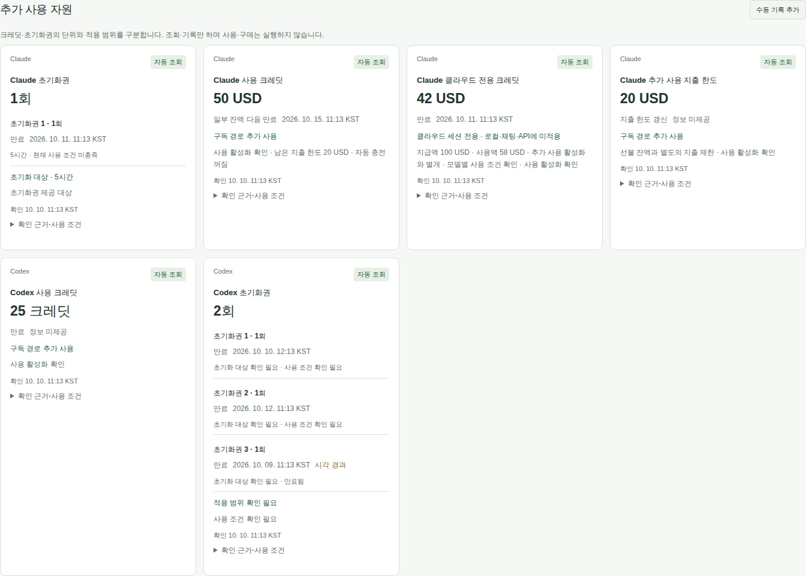

# 화면과 CLI

## 화면과 데이터 의미

화면은 **한도 · 계획 · 사용량 · 리포트 · 상태** 다섯 탭입니다(모바일은 아래 고정 막대). 설정은 탭이 아니라 헤더의 ⚙ 버튼(또는 `,` 키)으로 열고 ‘← 돌아가기’로 직전 탭에 돌아갑니다. 테마도 설정 맨 위에 있습니다. 키 `1`~`5`는 다섯 탭, `?`는 단축키 안내입니다. 예전 주소의 `?view=overview·analysis·insights·sources`는 각각 한도·사용량·리포트·상태로 연결됩니다.

**한도** 탭은 **구독 한도 → 다음 초기화 → 추가 사용 자원** 순서입니다. 잔여 한도와 초기화 시각을 먼저 확인합니다. 수동 자원 기록 양식도 여기에 있습니다.

**계획** 탭의 **지금 작업**에서 서비스·모델/한도 묶음·작업시간·속도 기준을 선택합니다. 같은 속도가 유지될 때의 지속 시간과 제약 한도를 보여 주고, 조건을 확인한 대안만 최대 두 개 제시합니다. 선택은 대시보드의 비교 기준이며 실제 사용하는 도구의 모델을 바꾸지 않습니다.
**다음 초기화** 일정은 펼치지 않아도 시각순으로 보입니다. 서비스 카드의 잔여량·최근 소모 속도·소진 전망도 상세 밖에 있습니다. 모바일 한도 목록은 한도별 잔여와 초기화까지 남은 시간을 한 줄씩 보여 주고, 서비스를 선택하면 카드를 엽니다. 그래프·과거 기록은 펼쳐 확인합니다.
주간 소진으로 짧은 창이 막힐 때도 원래 관측값을 바꾸지 않습니다. 오래되거나 초기화가 지난 값으로 잔여를 복원하지 않습니다.
**사용량** 탭은 필터 아래에 기간 요약과 추이·누적·점유율·토큰 구성·모델 순위·시간 패턴·모델 상세 표를 제공합니다. 같은 필터로 프로젝트별·세션별 사용량, 이전 기간과의 비교, 캐시 활용률 분석도 이 탭에서 봅니다. 기간·간격·제공사·서비스·모델·프로젝트로 좁힐 수 있습니다.
모델별 보기에는 모든 관측 모델을 유지하며 긴 순위·툴팁은 스크롤합니다. 모바일 날짜는 두 번 탭해 시간별로 내려갑니다.
날짜는 KST 시작일 포함, 종료일 다음 날 00:00 미만입니다. 주는 월요일 시작, 부분 주·월은 선택 구간만 합산합니다.
**리포트** 탭은 필터와 무관한 주간 리포트·일별 활동 달력·구독 가치 분석을 보여 줍니다(구독 가치의 기간 환산만 사용량 필터를 따릅니다).
**상태** 탭에는 수집 범위·수집원 상태와 데이터 신뢰도, 외부 알림 발송 이력, 이 기기의 오프라인 통계 삭제가 있습니다. 정상·미제공·실패·오래됨·미사용은 서로 다릅니다. 수동 갱신 완료는 시도 완료이며 제공사별 성공을 따로 확인해야 합니다.
설정은 구독료·단가·예산·알림·화면 갱신을 저장합니다. 계정 조회는 제공사의 캐시·대기 정책을 우회하지 않습니다.

## 작업 전망

- 최근 속도는 최근 30분 중 최소 15분, 비교 속도는 최근 3시간 중 최소 90분의 연속 관측을 사용합니다. 단위는 잔여율의 퍼센트포인트(%p)/시간입니다.
- 모델별 추가 한도와 공통 한도를 함께 봅니다. 모델 미지정·필수 한도 일부 오래됨·출처나 계정 불확실·최근 감소 없음은 무제한 또는 여유 있음으로 바꾸지 않습니다.
- 계정·구독 조건 변경, 초기화·잔여 증가·수집 중단에서는 속도 구간을 분리합니다. 계정 확인 이전의 이력을 새 계정에 소급 연결하지 않으므로 최초 연결 후에는 관측 시간이 필요합니다.
- 병렬 작업·웹·다른 기기의 소비가 포함된 계정 한도 속도입니다. 새 작업의 모델·추론 강도·문맥 길이가 달라지면 속도도 달라질 수 있습니다. 작업 완료를 보장하지 않습니다.
- 계획 중 초기화가 있으면 그 이후는 재확인 대상으로 표시합니다. 잔여율이 있어도 제공사가 사용 제한을 반환하면 제한을 표시합니다.

**오늘·이번 주 작업 전망**은 계획 탭의 지금 작업 바로 아래에 항상 펼쳐져 있습니다. 위에서 선택한 서비스·모델을 사용하고 사용량 탭의 필터와는 별도입니다. 하루 24시간 사용한다고 가정하지 않고 직접 입력한 작업시간을 같은 속도의 연속 사용량으로 환산합니다. 초기화 이후 자원을 더해 주간 전체의 사용 가능 시간을 보장하지 않습니다.

## 크레딧·초기화권과 수동 기록

추가 사용 자원에서는 보유 잔액, 별도의 추가 사용 지출 한도, 초기화권을 구분합니다. Codex는 기존 App Server 응답, Claude는 기존 OAuth와 기본 로그인 계정·조직 정보로 조회합니다. Claude 추가 자원 정상 조회 간격은 15분이며 인증 오류·조회 제한은 별도 대기 정책을 적용합니다.

| 표시 | 의미 |
|---|---|
| 자동 조회 | 제공사 응답의 현재 관측. 적용 범위·사용 조건은 별도 확인 |
| 수동 확인 | 사용자가 직접 확인한 기록. 자동 수신과 구분 |
| 미제공·조회 실패·출처 간 차이 | 수치나 조건을 현재 확정할 수 없음 |
| 오래된 기록·계정/조건 변경 | 현재 작업의 확정적인 근거로 사용하지 않음 |
| 확인된 0 | 원본 또는 수동 기록이 명시한 잔액·개수 0. 미제공과 다름 |

잔액이 있어도 추가 사용 비활성화·지출 제한 도달·모델/경로 제한 때문에 사용할 수 없을 수 있습니다. 자동 충전은 앞으로 결제가 발생할 수 있다는 조건이며 현재 보유량이나 무제한 용량으로 합산하지 않습니다. 통화·단위가 불명확하면 원본 소액 단위로 표시하고 USD라고 가정하지 않습니다. API 단가 환산 비용으로 크레딧 소모 시간을 만들지 않습니다. 별도 소비 속도는 같은 결제기간의 명시적 누적 지출 원본이 있을 때만 계산합니다.

Claude 클라우드 전용 프로모션은 일반 선불 잔액과 별도로 지급액·사용액·잔액·만료를 표시합니다. 로컬 Claude Code·채팅·Cowork·API에 쓰는 잔액으로 합산하거나 추천하지 않습니다. 추가 사용 활성화와도 별개이며 모델별 예외는 [제공사 사용 조건](https://support.claude.com/en/articles/17152539-cloud-sessions-bonus-credit-promotion)을 확인합니다. 이 프로모션의 만료 시각은 잔액이 다시 채워지는 시각이 아닙니다.

각 초기화권의 만료일은 카드 안에 개별 목록으로, 크레딧의 만료일은 잔액 바로 아래에 표시합니다. 상세를 펼칠 필요가 없으며 연도·날짜·한국 시간(KST)을 함께 보여 줍니다. 원본에 날짜가 없으면 **정보 미제공**, 일부 잔액의 다음 만료만 있으면 **일부 잔액 다음 만료**로 구분합니다. 시각이 지났다는 표시는 보유 개수나 잔액을 임의로 재계산하지 않습니다. 지출 한도에는 만료 대신 제공사의 갱신 시각을 표시합니다.



초기화권 개수와 상세 목록 길이는 다를 수 있습니다. Codex의 보유 개수는 제공사 집계를 사용합니다. Claude 상세에 초기화 대상이 있으면 표시하지만, 한 창만 복원하는 초기화권으로 다른 소진 한도까지 해결된다고 가정하지 않습니다. 만료 미제공은 영구 사용 가능을 뜻하지 않습니다. 제공사 확인 링크에서 사용 조건을 확인하며 대시보드에는 사용·구매 버튼이 없습니다.

수동 기록은 이름·잔액/횟수·단위·적용 범위·확인 시각·만료와 사용 조건을 입력합니다. 시간 입력은 KST입니다. 같은 자동 자원에 연결하면 중복 합산하지 않고 차이를 표시합니다. 자동값이 확인되지 않으면 수동 기록을 참고할 수 있지만 자동 검증값으로 승격하지 않습니다. 수동 기록은 마지막 확인 후 7일이 지나면 오래된 기록으로 표시합니다. API 전용 기록은 구독 계정 변경과 독립적으로 유지합니다.

저장 실패 시 현재 페이지의 입력을 유지합니다. 수정 충돌은 최신 기록을 확인한 뒤 다시 저장합니다. 새 기록의 같은 저장 요청을 재시도해도 중복 생성하지 않으며, 그 사이 다른 수정이 있으면 충돌로 알립니다. 미저장 입력은 브라우저를 닫거나 새로고침하면 사라집니다. 기록 삭제는 제공사 자원을 삭제하거나 소비하지 않습니다.

```text
합계 = 일반 입력 + 캐시 읽기 + 캐시 생성 + 출력
추론은 출력에 포함된 별도 관측이며 합계에 다시 더하지 않음
캐시 활용률 = 캐시 읽기 / (일반 입력 + 캐시 읽기 + 캐시 생성)
```

OpenCode처럼 원본 output에 reasoning이 빠지면 정규화에서 한 번 더합니다. 미제공 추론은 0으로 위장하지 않습니다.
비용은 1M 토큰당 USD API 단가의 환산 가치이며 구독 청구액·실제 절감액이 아닙니다. 단가 없는 모델, 원본 없는 장문 티어·캐시 저장량·시간대 요금은 임의 추정하지 않습니다.
날짜형 단가의 웹 수정은 오늘(KST)부터 적용하고 과거 이력을 유지합니다. 평면 단가 수정은 전체 기간에 영향을 줍니다.

## 설정 편집·조회 실패·CSV

단가 한 행을 저장해도 다른 행과 설정의 미저장 입력은 유지됩니다. 일반 설정의 입력은 현재 페이지 메모리에만 남고 탭 이동 중에는 유지되지만, 페이지를 닫거나 새로고침하거나 연결이 끊기면 사라집니다. 비밀 입력은 탭 재진입 시 비웁니다. 일괄 저장의 실패 행은 안내를 확인하고 다시 저장하세요. 구독료를 비워도 서비스 입력칸은 남아 다시 설정할 수 있습니다.

필터를 바꾼 뒤 인사이트 조회에 실패하면 이전 기간 표 대신 오류와 다시 불러오기를 표시합니다. 이 재시도는 제공사 수집을 요청하지 않습니다. 일반 API 응답은 30초, 수집 상태 조회는 10초, 접수 후 수집 완료 대기는 전체 90초로 제한합니다. 저장·수집 요청의 시간 초과는 서버 작업 취소를 뜻하지 않으며 처리 상태를 확인한 뒤 재시도하세요.

비용 추이 CSV는 기존 비용 열 뒤에 항목별 `미산정 토큰`과 `합계 미산정 토큰` 열을 추가합니다. 전부 미산정인 비용은 빈칸, 부분 산정은 확인된 비용과 미산정 토큰을 함께 내보냅니다. 실제 무료 사용과 사용 없음은 0입니다. 합계도 같은 규칙이며 부분 산정 비용을 전체 비용으로 해석하지 마세요. 토큰·요청 수 CSV 형식은 유지됩니다.

## CLI

```bash
.venv/bin/llm-usage usage --period 7d --group model
.venv/bin/llm-usage usage --period custom --start 2026-01-01 --end 2026-01-07 --granularity day
.venv/bin/llm-usage usage --period 30d --scope route:codex
.venv/bin/llm-usage limits
.venv/bin/llm-usage brief
.venv/bin/llm-usage collect --once
```

collect는 계속 실행, --once는 한 번 실행입니다. systemd 수집기가 실행 중이면 웹 수동 갱신을 사용해 중복 실행을 피하세요.
출력에도 개인 통계가 포함될 수 있으므로 공개 로그에 남기지 않습니다.

## 오프라인·알림·업그레이드

브라우저는 허용된 최근 통계·한도·크레딧·수동 기록 응답을 Cache Storage에 저장하고 연결 실패 시 사본의 시각과 오프라인 안내를 표시합니다. 사본의 잔여량을 현재값으로 복원하지 않으며 현재 추천·예측을 해제합니다. 자동 갱신을 꺼도 시간이 지나면 상태를 다시 평가합니다.
설정·CSRF·쓰기 응답은 저장하지 않습니다. 오프라인에서는 설정 저장과 수동 자원 저장을 차단하고 로컬 통계 사본 삭제는 허용합니다. 수동 자원 입력은 페이지 안에서 초안으로 남길 수 있습니다. 온라인 후속 조회는 통계를 다시 저장합니다.
구버전 캐시 정리는 새 코드를 받은 뒤 수행됩니다. 계속 오프라인인 기기는 브라우저 사이트 데이터에서 직접 삭제하세요.
브라우저 알림은 열린 페이지의 갱신 시 감지한 변화에만 동작합니다. 닫힌 페이지의 백그라운드 push는 제공하지 않습니다.
페이지를 닫아도 받으려면 수집기의 ntfy·webhook·Telegram 알림을 선택합니다. 채널에 예산·사용 통계 등 알림 내용이 전송됩니다. 모바일 OS의 실제 알림 표시는 기기별 확인이 필요합니다.
새 이벤트의 프로젝트명은 경로 마지막 디렉터리 또는 Git 저장소 이름을 사용합니다. 기존 Codex 체크포인트에서 이어 읽을 때도 신규 이벤트에 적용하며, 기존 이벤트 ID의 이름은 세션 재구성 시 보존합니다. 같은 basename은 합쳐질 수 있습니다.
기존 DB는 일괄 변환하지 않습니다. 이전 경로형 이름과 새 이름이 분리되고 예산을 다시 설정해야 할 수 있습니다. 기존 DB까지 익명화됐다고 가정하지 마세요.

단가 선택 오류를 수정하면 과거 이벤트를 조회한 비용 추정도 바뀔 수 있습니다. 원본 토큰은 유지됩니다. 이미 저장된 주간 보고서는 생성 당시 결과이며 자동 재작성하지 않습니다.
